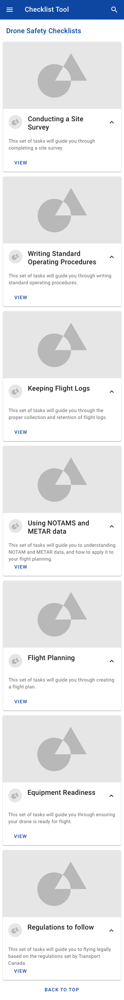
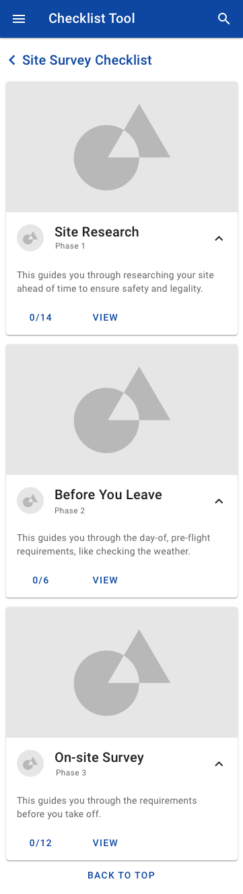
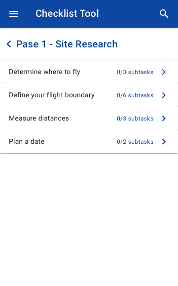
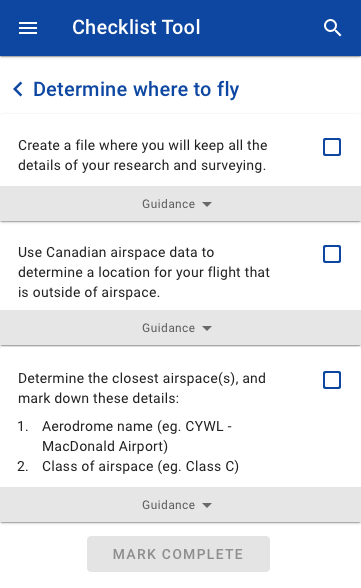
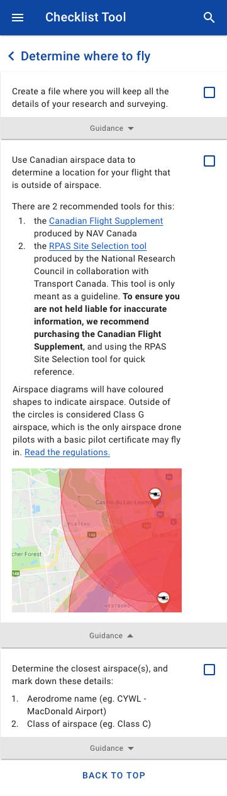
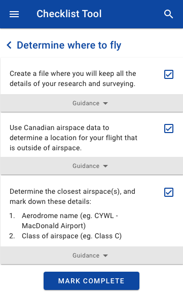
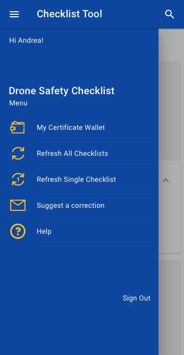
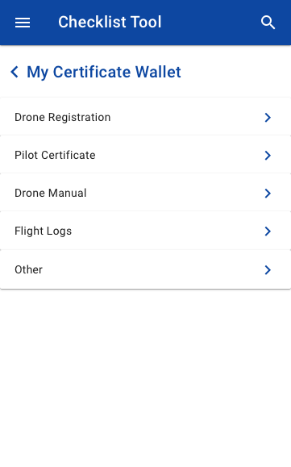
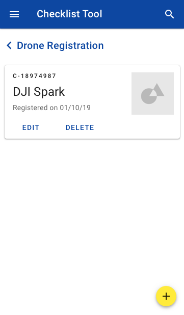

# Concepts Gallery

### Alpha, first prototypes

**Checklist**

From all the concepts research, we determined the "Let's Do It" direction was not a feasible option. Therefore we decided to explore the easiest option and see if it would satisfy the objectives. This was the "checklist" direction. We prototyped an application that would simply list the steps in a site survey and allow users to check them off as they completed the site survey. 

We tested this prototype and found that the majority of users could not make the correct determination of where to fly based on the materials provided. We observed them trying to teach themselves, ignoring our big blocks of instructional text. This lead us to believe than an educational direction might prove more useful. 

