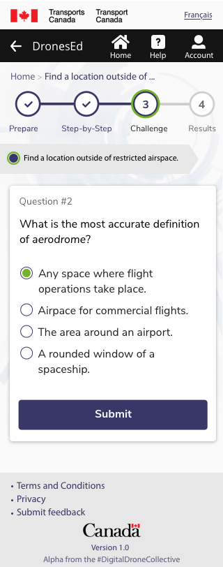

# Beta gallery

### Beta, final prototype

After we discovered that the checklist wasn't working for the complexity of the site survey, we pivoted to focusing more on educating drone pilots. By structuring content in the form of an educational lesson, we were able to have better information architecture for the various levels of information. 

